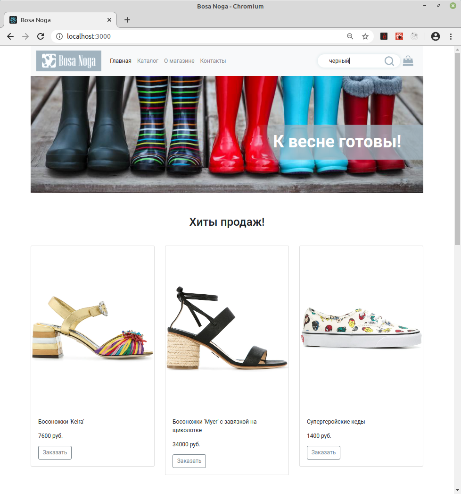
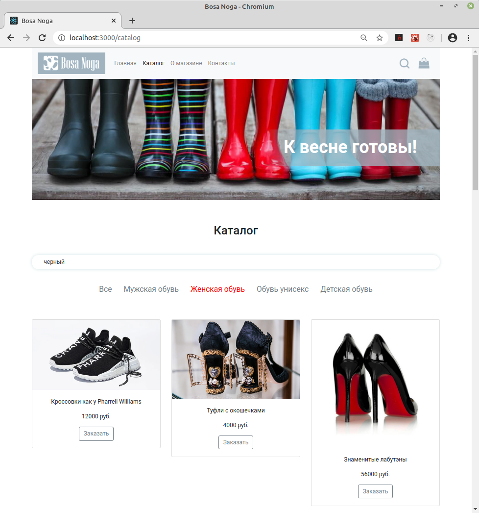
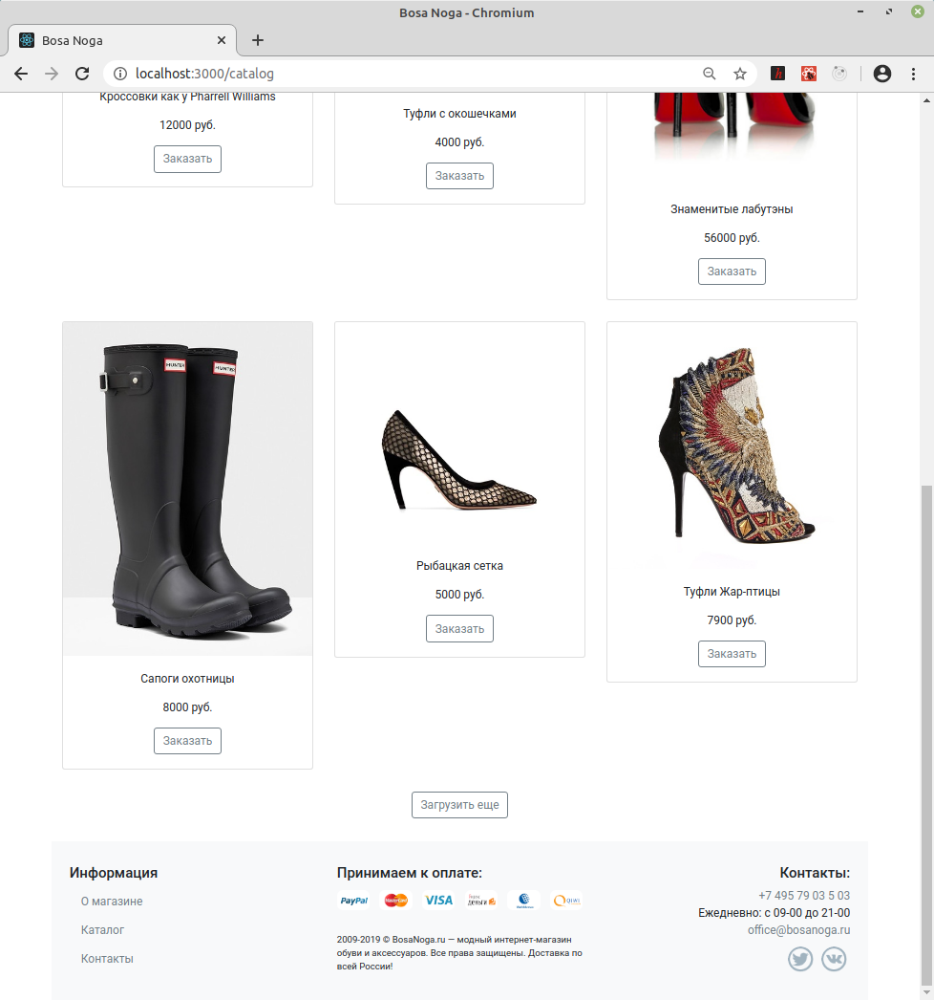
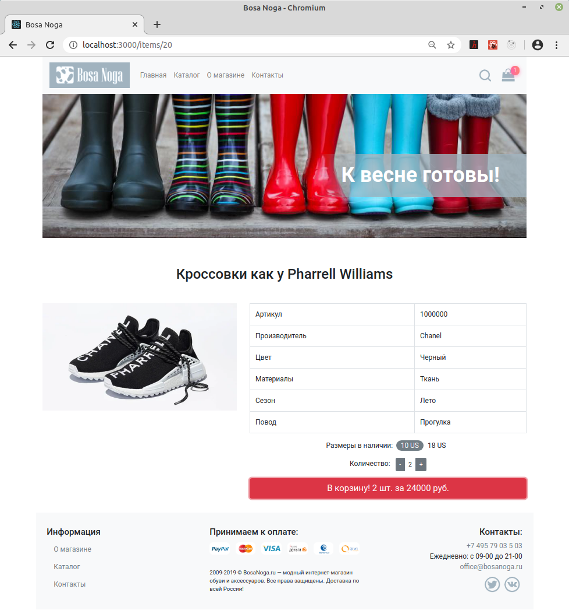
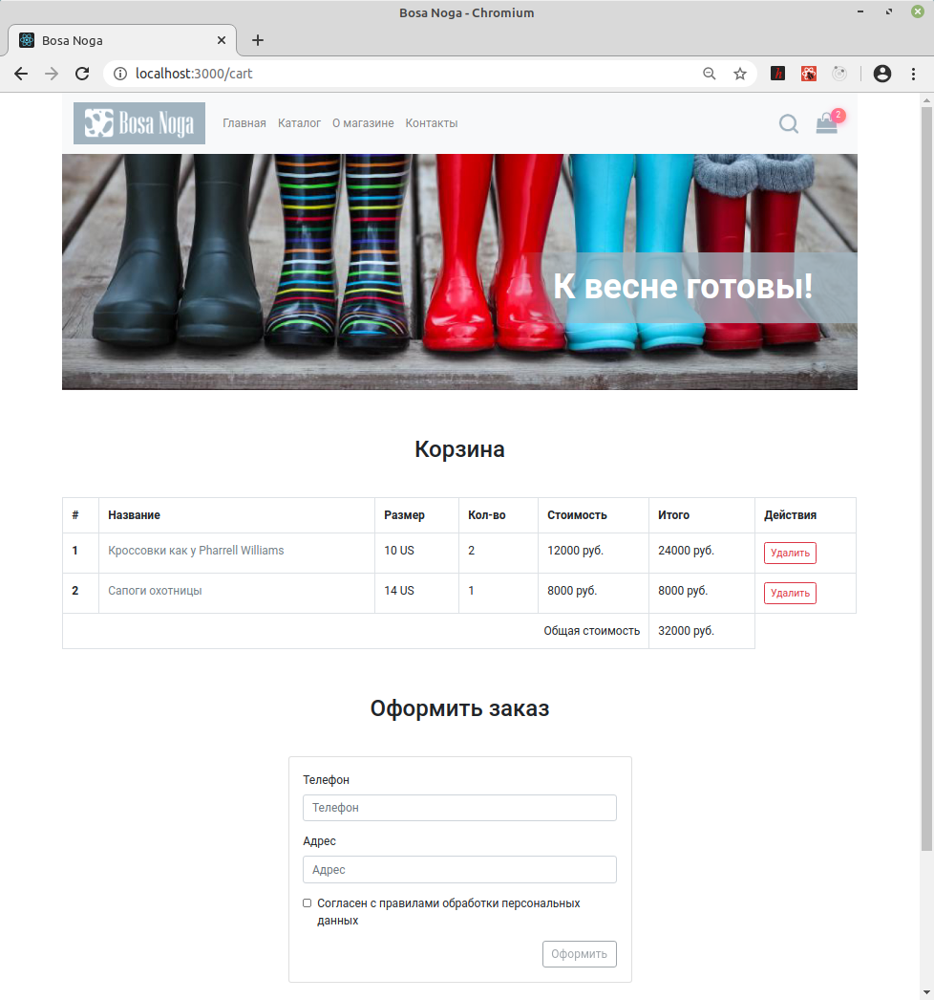

## Выпускной проект на курсе "Нетологии" по React &ndash; магазин обуви
\
[>> код <<](https://github.com/vaniya-k/netology_bosa_noga)&nbsp;&nbsp;&nbsp;/&nbsp;&nbsp;&nbsp;[>> ТЗ <<](https://github.com/netology-code/ra16-diploma)

Мой второй по объему проект &ndash; гораздно проще, чем Six Cities, но зато "размял" хуки и Context API. Здесь тоже весь функционал по ТЗ реализован и проект был сдан срок. Опять таки, код-эталона или прочего не было, а ментора не побескоил ни разу.

\
Ключевые моменты:
- [x] все на функциональных компонентах &ndash; с хуками и без
- [x] корзина хранится в localStorage
- [x] немного Context API, где требуется (счетчик на иконке корзины и поисковый запрос из "шапки")
- [x] роутинг на react-router-dom и history
- [x] работа с API &ndash; как напрямую через fetch, так и через кастомный хук на базе fetch

\
Скриншоты:
* Главная (поиск из "шапки" открывает каталог и прокидывет запрос туда же)
\
\

* Каталог
\
\

* "Подвал"
\
\

* Страница с деталями товара
\
\

* Корзина
\
\

