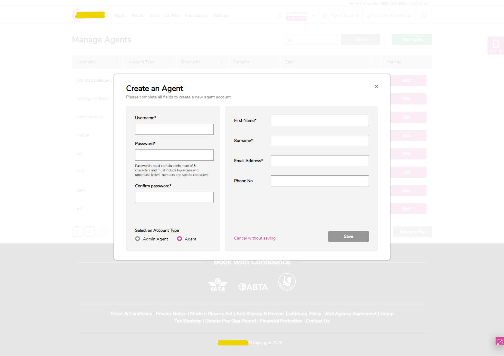
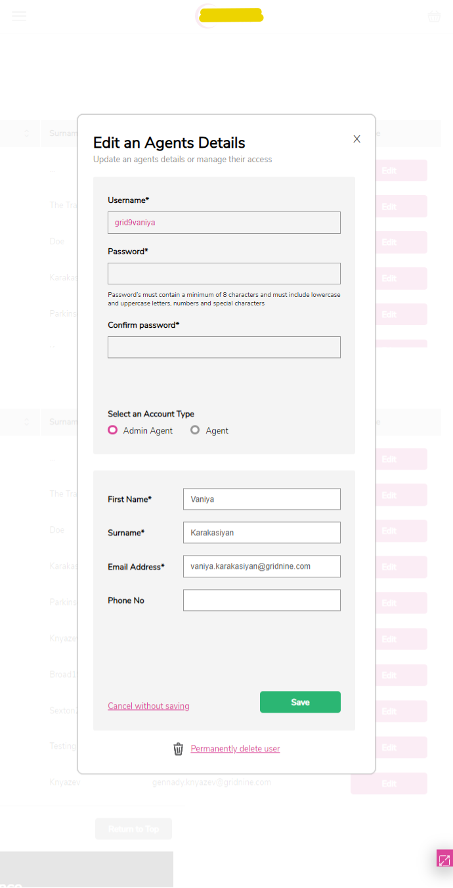

## Новый раздел для управления пользователями + переработанный логин, регистрация, сброс пароля на сайте дистрибьютора туров
*по соображениям авторских прав, после описания представлены только скриншоты &ndash; но для некоммерческих проектов есть опции >> покликать самому(-ой) << и >> посмотреть код <<*

\
Для новой версии сайта дистрибьютора туров требовалась поддержка системы учетных записей на Azure B2C (регистрация, логин, восстановление пароля и т.д.), также необходимо было внедрить новый функционал для администраторов конечных турагенств по управлению своими пользователями. Проект успешно и в срок выполнила команда из двух человек -- фронтендера (меня) и бэкендера. Зачастую мне еще приходилось ассистировать русскому бэкендеру, что касалось общения с командой заказчика из Англии, и решать текущие оргвопросы.

На скриншотах представлены исключительно компоненты по управлению пользователями &ndash; остальные участки фронтенда по проекту содержат гораздо меньше верстки и логики.

\
**Ключевые моменты:**
- [x] React-компоненты на Typescript
- [x] верстка адаптивных Zeplin-макетов, стили на SCSS
- [x] разработка по scrum

\
**Скриншоты:**
\

\

\

\

\
