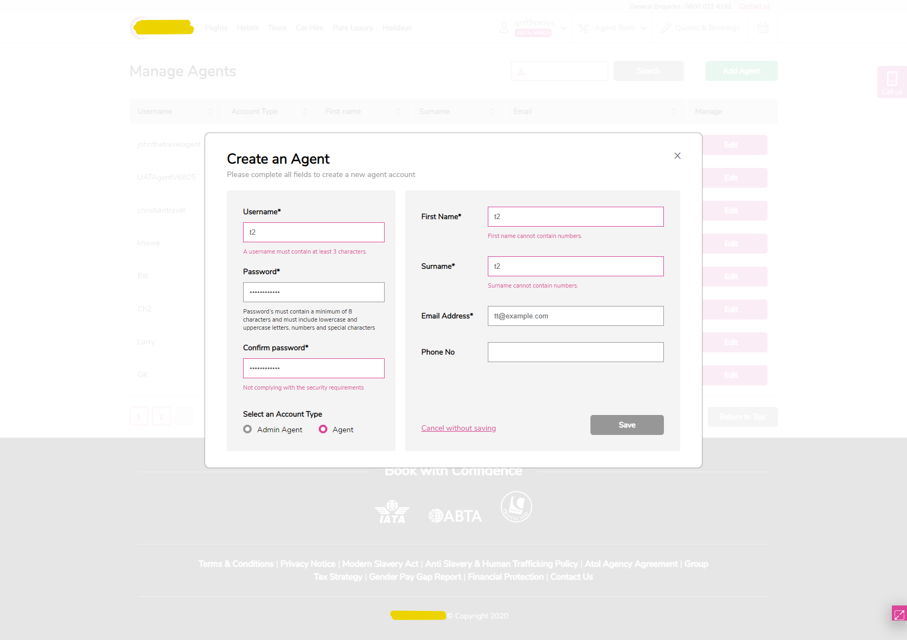

## Выпускной проект на курсе HTML Academy по React &ndash; Six Cities
\
[>> покликать самому <<](https://six-cities-by-vaniya-k.netlify.app/)&nbsp;&nbsp;&nbsp;/[>> посмотреть код <<](https://github.com/vaniya-k/1353919-six-cities-3)&nbsp;&nbsp;&nbsp;/&nbsp;&nbsp;&nbsp;[>> оценить ТЗ <<](specs.pdf)
\
\
Сервис краткосрочной аренды для туристов. ТЗ выполнено в полном объеме и все было сдано в срок. Верстка предоставлялась с ТЗ. Никаких "шпаргалок" в виде код-эталона или прочего не было. Консультаций ментора суммарно набралось где-то на полтора часа из отпущенных пяти.

P.S. Если пойдете "на покликать", то залогиньтесь любым сочетанием пароля и почты (ничего нигде не сохраняется и не проверятся), чтобы на время сессии можно было добавлять позиции в избранное и потом управлять списком закладок. 

\
_**Ключевые моменты:**
- [x] SPA на React, Redux+thunk, axios
- [x] ручной конфиг webpack и babel
- [x] jest: снапшот-тесты всех компонентов с представлением и юнит-тесты всех экшенов в редьюсерах 
- [x] интеграция карт с помощью "чистого" leaflet (без react-leaflet)

\
_**Скриншоты:**_
* Логин 
\
\

* Каталог
\
\

* Страница с деталями
\
\

* Блок с отзывами на странице с деталями (при анонимной сессии нельзя оставлять отзыв самому)
\
\

* Другие предложения поблизости на странице с деталями
\
\

* Страница с личными "закладками" (не доступна при анонимной сессии)
\
\

