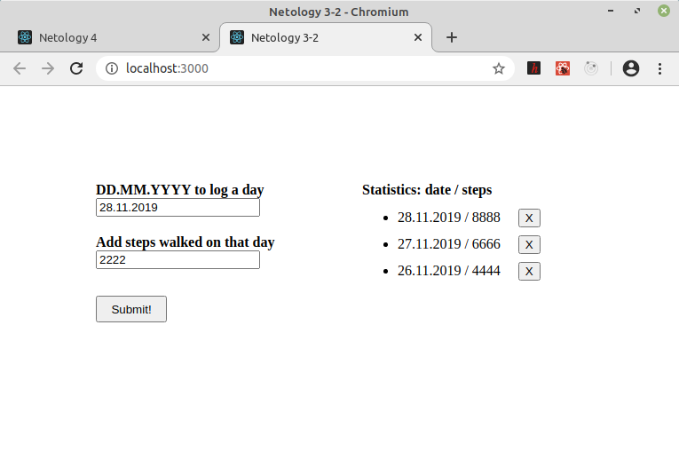
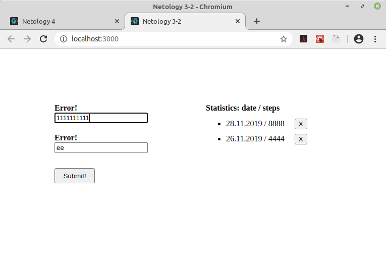

## Трекер шагов по датам
\
[https://github.com/vaniya-k/netology_homeworks/tree/3-2_done/](https://github.com/vaniya-k/netology_homeworks/tree/3-2_done/)

Компонент-контейнер с логикой на работу с позициями, внутри которого независимые друг от друга компоненты формы и списка. Форма также выполняет валидацию полей на основе регулярных выражений, повторный Submit одной и той же даты увеличивает текущее значение. Список выводит позиции в хронологическом порядке. Все на хуках.

* Базовый вид
\
\

* Пример ошибок при некорректном вводе даты и количества шагов
\
\

