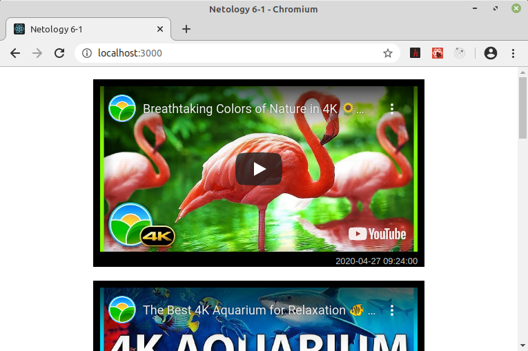

## HOC для приведения дат под роликами в "человеческий" вид
\
[>> код <<](https://github.com/vaniya-k/netology_homeworks/tree/6-1_done/)
\
\
Если прошло менее часа &ndash; отсчет в минутах; менее суток &ndash; в часах; далее &ndash; в днях.

\
_**Скриншоты:**_
* До
\
\

* После
\
\

