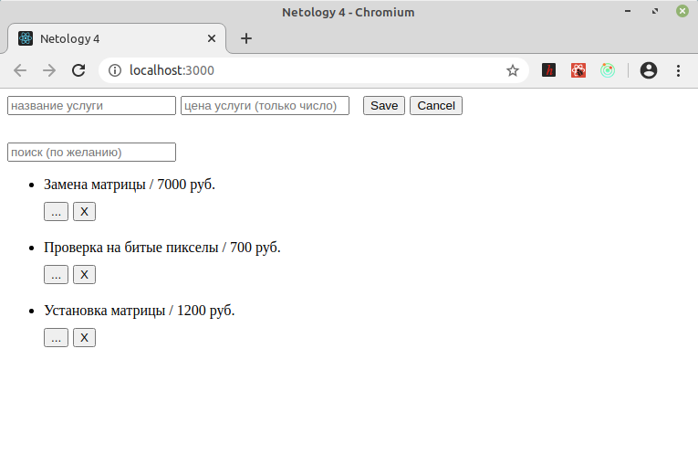
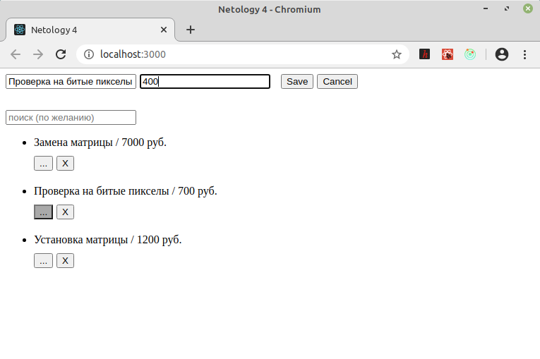
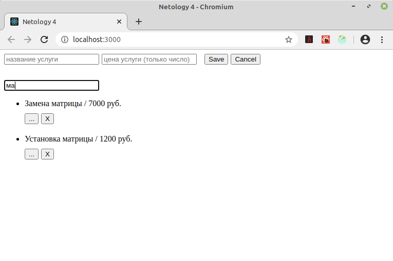

## Редактируемый список услуг на Redux
\
[>> код <<](https://github.com/vaniya-k/netology_homeworks/tree/4-full_done/)

Два независимых компонента -- форма ввода и список с полем поиска, которые, собственно, используют Redux для манипуляции общим стейтом через хуки useSelector и useDispatch. CRUD для позиций реализован полностью.

\
_**Скриншоты:**_
* Базовый вид
\
\

* Редактирование
\
\

* Поиск по списку
\
\

