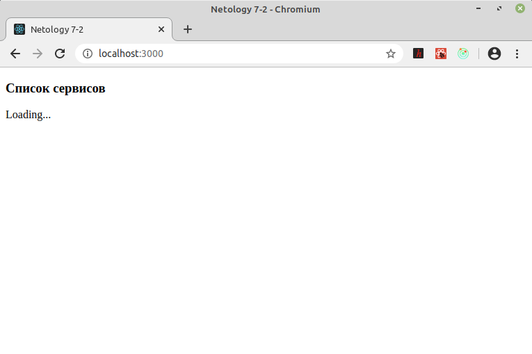
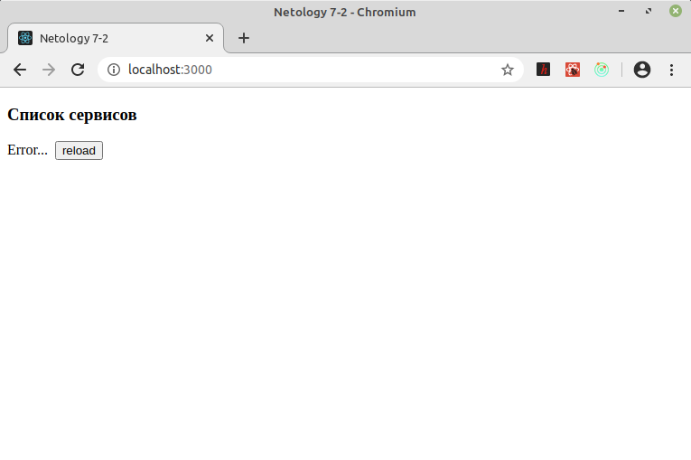
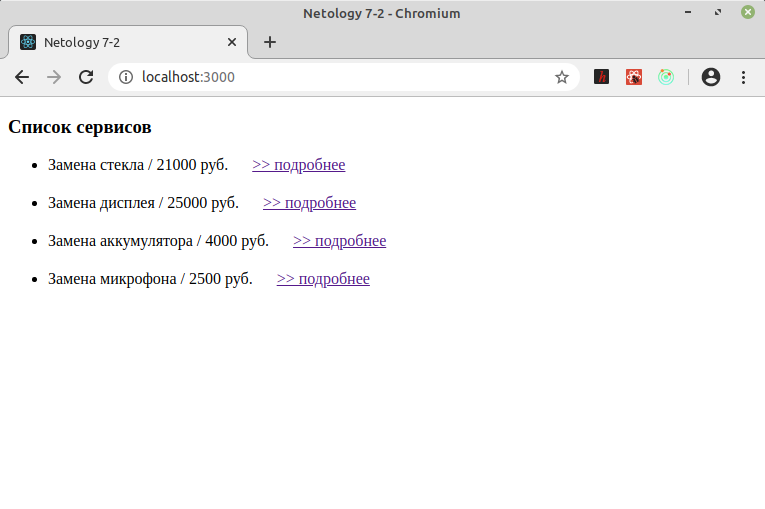

## Saga- и Observable-реализации реакций на текущее состояние загрузки
\
Одна и та же задача реализована разными инструментами, чтобы их сравнить.

Saga [>>](https://github.com/vaniya-k/netology_homeworks/tree/8-2_done/)
\
Observable [>>](https://github.com/vaniya-k/netology_homeworks/tree/7-2_done/)

* Загрузка
\
\

* Ошибка
\
\

* Отрендеренный список
\
\

