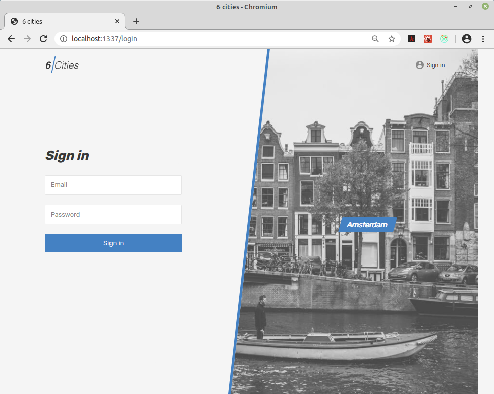
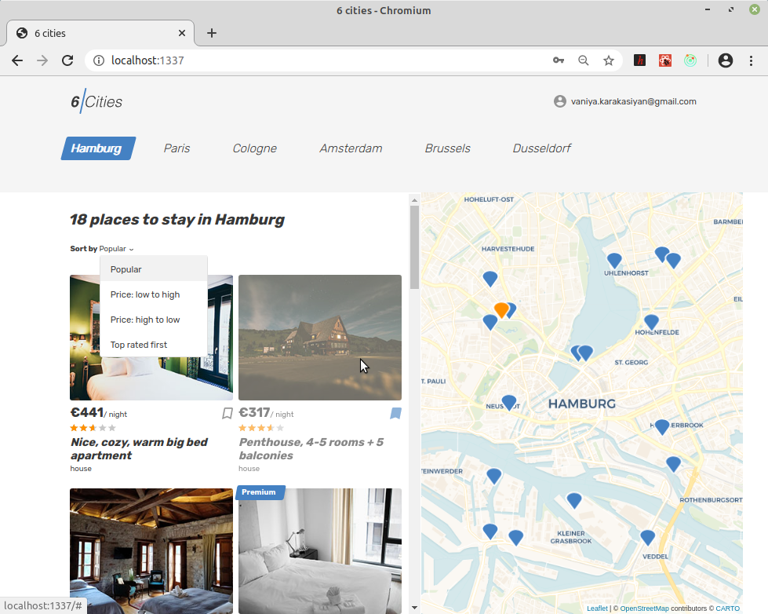
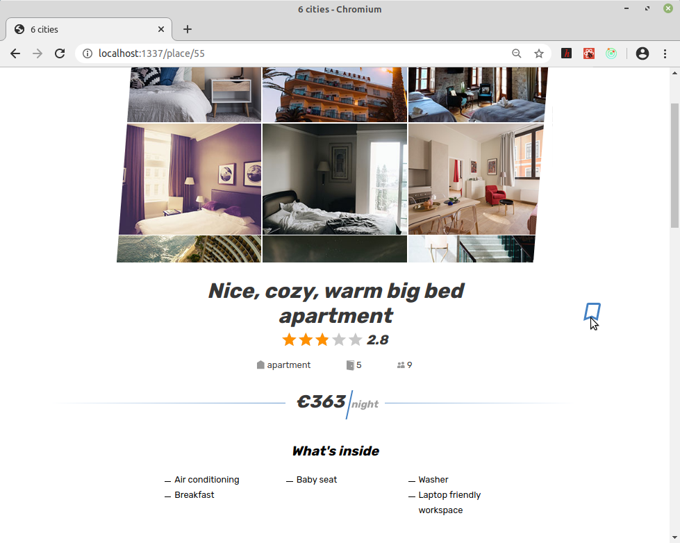
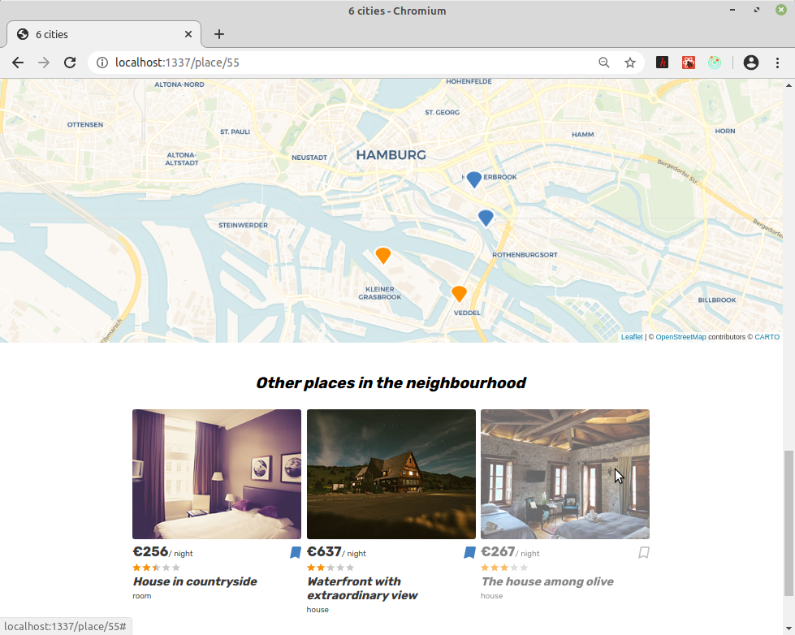
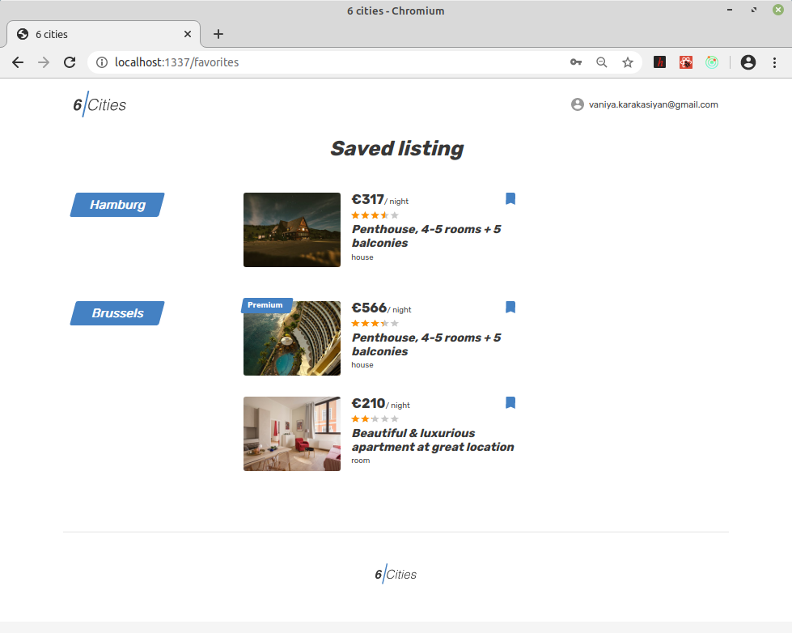

## Выпускной проект на курсе HTML Academy по React &ndash; Six Cities
\
[>> код <<](https://github.com/vaniya-k/1353919-six-cities-3)&nbsp;&nbsp;&nbsp;/&nbsp;&nbsp;&nbsp;[>> ТЗ <<](specs.pdf)

Стек:
- [x] Ручной конфиг webpack и babel (без create-react-app)
- [x] Классовые компоненты без стейта, когда нужны триггеры жизненного цикла; внутренний стейт только через HOC-компоненты
- [x] Redux+thunk
- [x] роутинг на react-router-dom и history
- [x] работа с внешним API, предоставленным HTML Academy, через axios
- [x] Снапшот-тесты на jest всех компонентов с представлением
- [x] Юнит-тесты на enzyme всех экшенов в редьюсерах
- [x] интеграция карт с помощью "чистого" leaflet (без react-leaflet)

* Логин 
\
\

* Каталог
\
\

* Страница с деталями
\
\

* Блок с отзывами на странице с деталями (при анонимной сессии нельзя оставлять отзыв самому)
\
\

* Другие предложения поблизости на странице с деталями
\
\

* Страница с личными "закладками" (не доступна при анонимной сессии)
\
\

