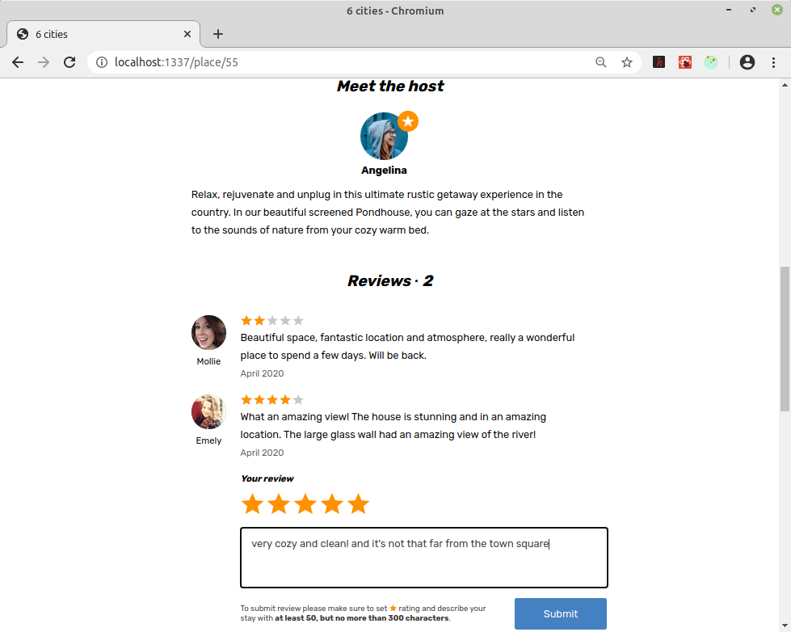

## Выпускной проект на курсе HTML Academy по React &ndash; Six Cities
\
[https://github.com/vaniya-k/vanilla-2-vue-basics](https://github.com/vaniya-k/vanilla-2-vue-basics)

Мой текущий magnum opus.

([ТЗ](specs.pdf))

* Логин 
\
\

* Каталог
\
\

* Страница с деталями
\
\

* Блок с отзывами на странице с деталями (при анонимной сессии нельзя оставлять отзыв самому)
\
\

* Другие предложения поблизости на странице с деталями
\
\

* Страница с личными "закладками" (не доступна при анонимной сессии)
\
\

