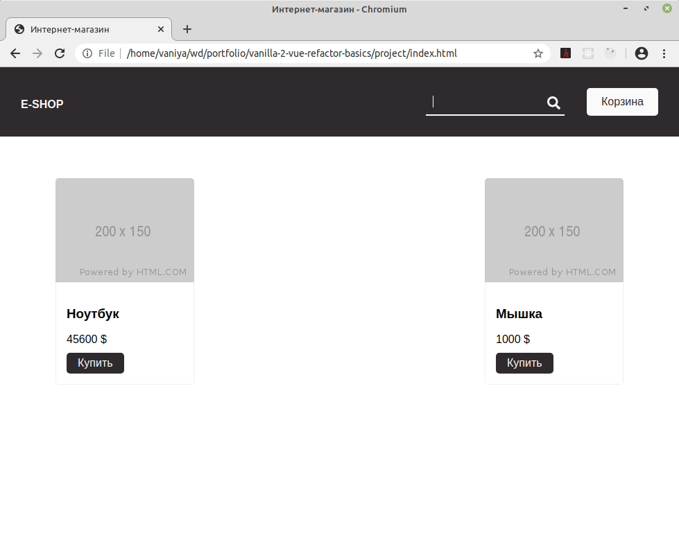
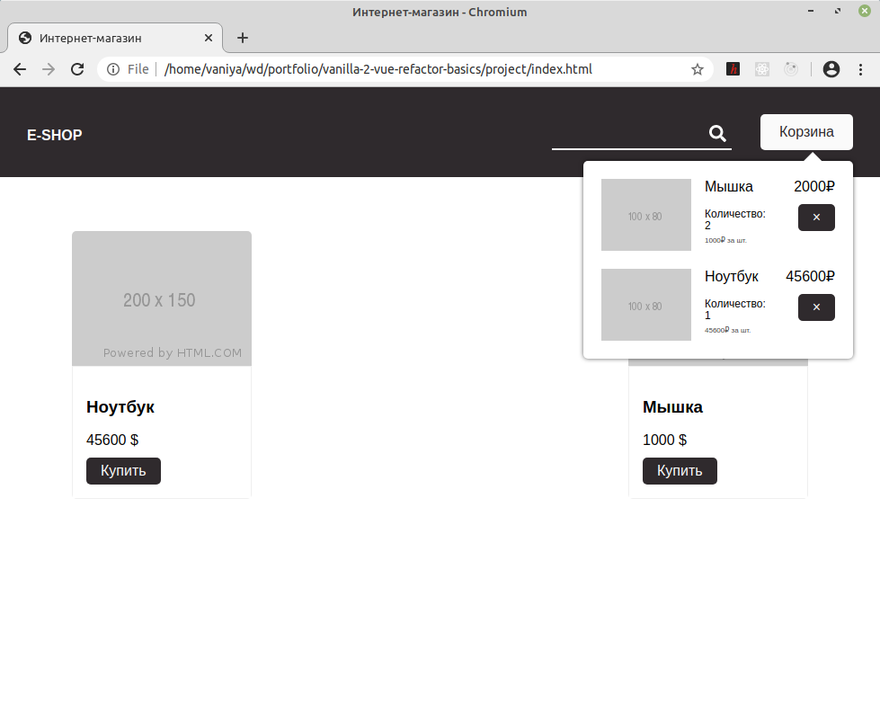
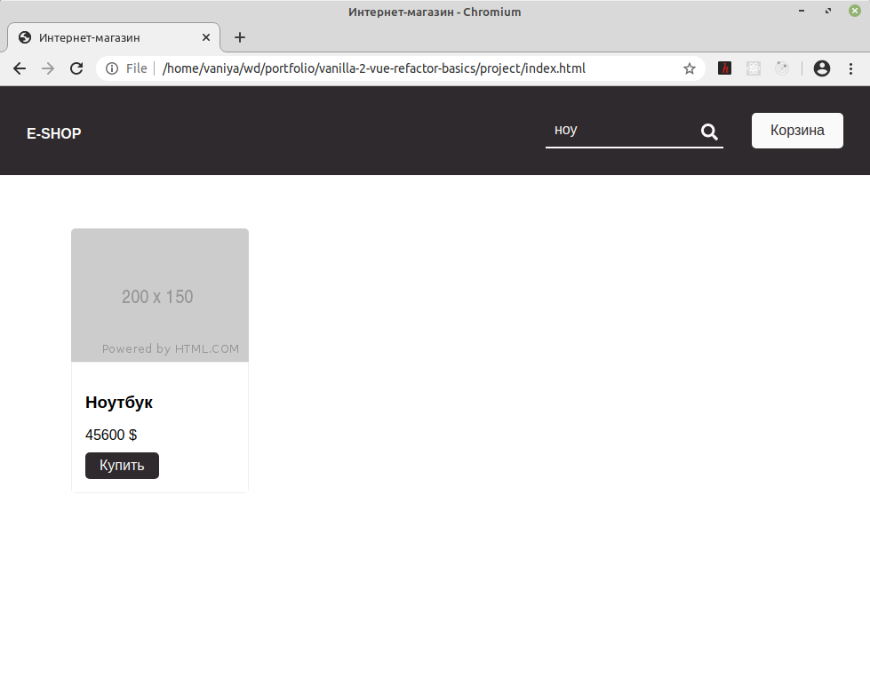

## Перевод мокапа интернет-магазина с "ванильного" JS на Vue
\
[https://github.com/vaniya-k/vanilla-2-vue-basics](https://github.com/vaniya-k/vanilla-2-vue-basics)

Задание с курсов GeekBrains. Первая часть задания: рефакторинг исходника на "ванильном" JS, чтобы на выходе было Vue-приложение. Вторая часть задания: имплементация поиска, которого не было в исходнике.

* Базовый вид
\
\

* Корзина
\
\

* Поиск
\
\

