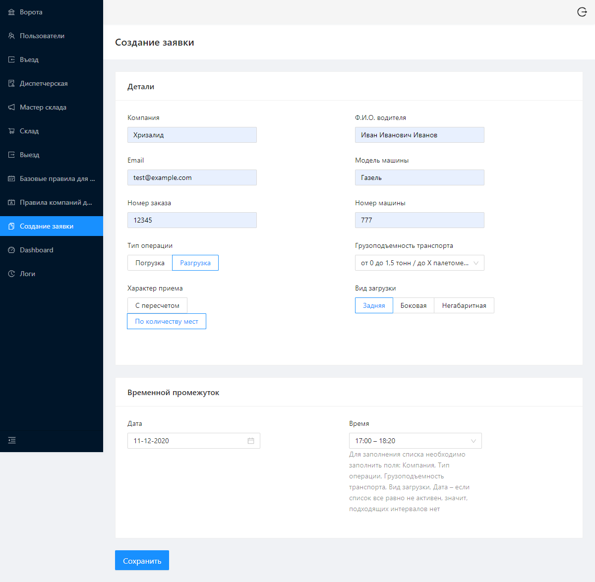
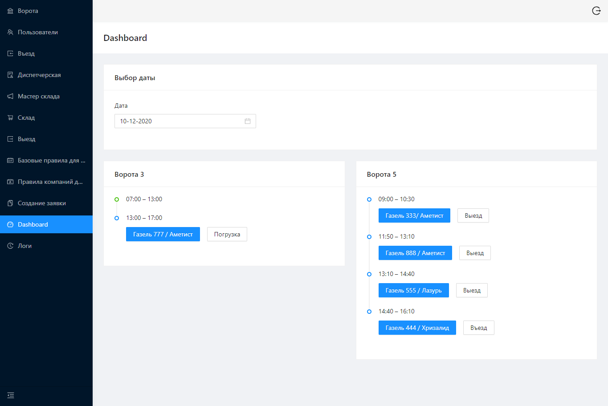
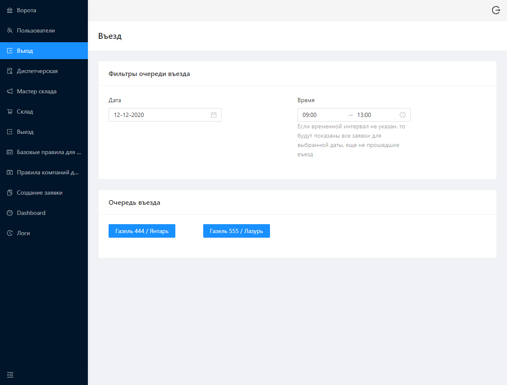
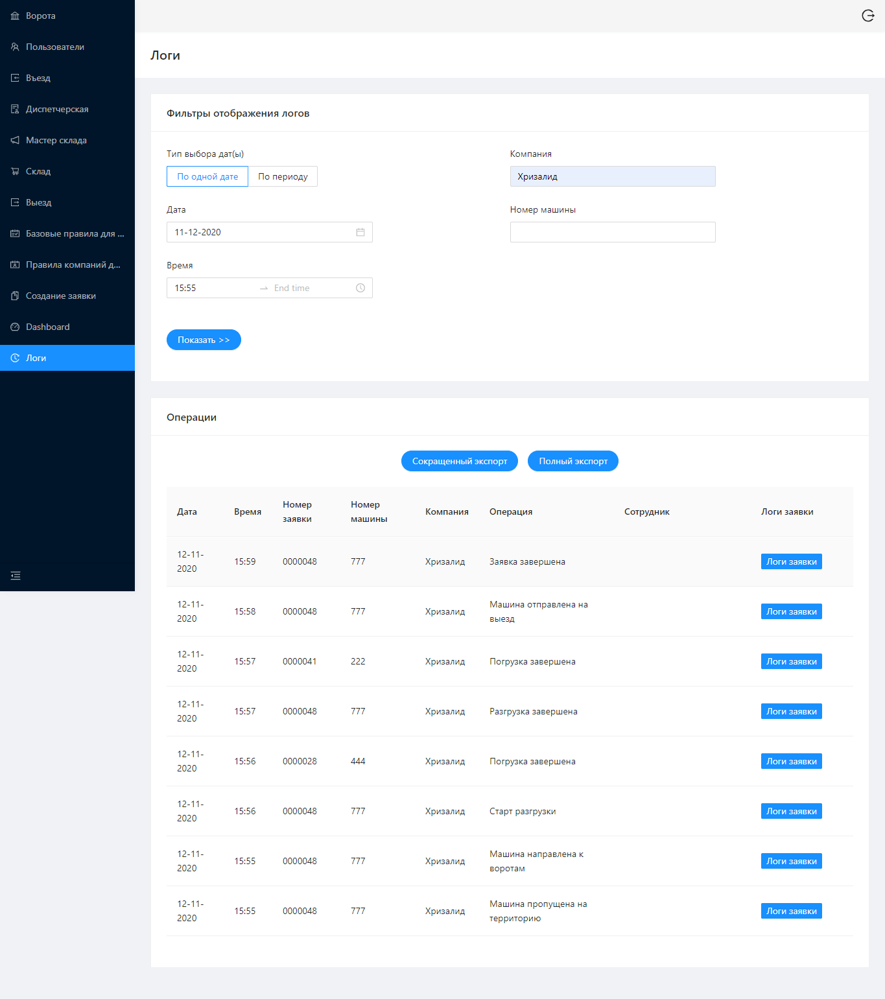
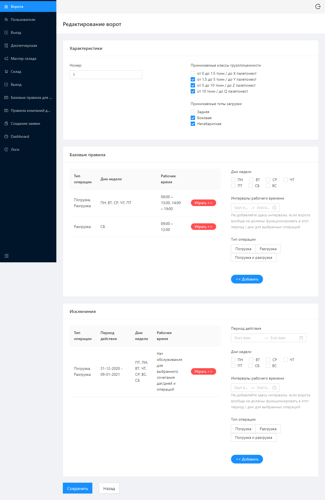
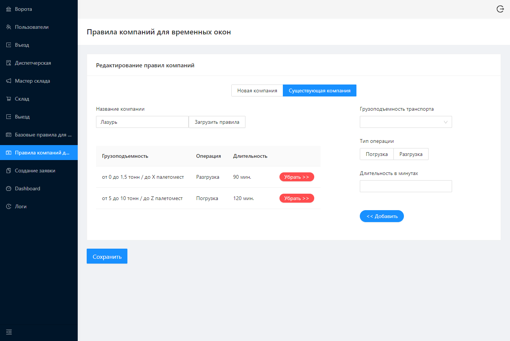

## Система управления и продвижения складских заявок
*по соображениям авторских прав, после описания представлены только скриншоты &ndash; но для некоммерческих проектов есть опции >> покликать самому(-ой) << и >> посмотреть код <<*

\
В основе системы лежит создание заявок на погрузку / разгрузку и их продвижение через ряд этапов (охрана на въезде, диспетчерская, начальник склада, кладовщики, охрана на выезде), на каждом из которых соответствующим сотрудников вносятся необходимые для продвижения и документирования данные (количество занятых палетомест, номер пломбы и так далее). Система позволят тонко настраивать параметры отдельных ворот и их графики ворот, задавать продолжительность операций в зависимости от вводных характеристик заявки.

Выполнил 95% всего фронтенда на проекте. А до начала разработки занимался прототипированием и уточнением бизнес-процессов напрямую у заказчиков. Уже в процессе разработки консультировал бэкендеров по бизнес-процессам.

На скриншотах предствлена выборка наиболее отличающихся друг от друга экранов.

\
**Ключевые моменты:**
- [x] SPA c React-компонентами на Typescript
- [x] Ant.design
- [x] сгенерированные Swagger'ом рест-утилиты 

\
**Скриншоты:**

* Создание заявки

* Дэшборд

* Очередь въезда

* Оформление разгрузки

* Настройки ворот

* Настройки ворот

* Индивидуальные правила партнера

