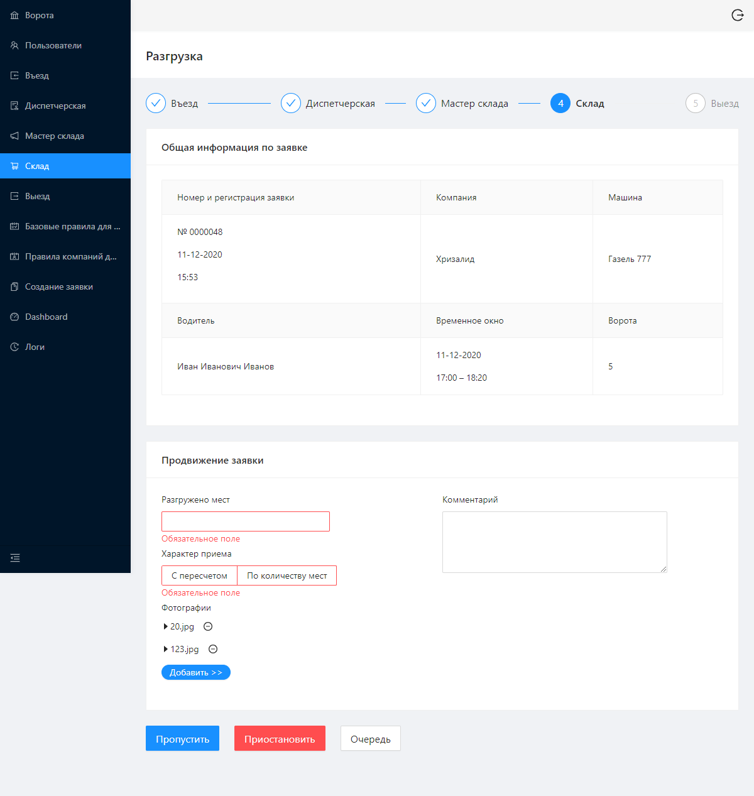

## Система управления и продвижения складских заявок
*по соображениям авторских прав, после описания представлены только скриншоты &ndash; но для некоммерческих проектов есть опции >> покликать самому(-ой) << и >> посмотреть код <<*

\
Lorem
Lorem
Lorem

\
**Ключевые моменты:**
- [x] SPA c React-компонентами на Typescript
- [x] Ant.design
- [x] сгенерированные Swagger'ом рест-утилиты 

\
**Скриншоты:**

* Создание заявки

* Дэшборд

* Очередь въезда

* Оформление разгрузки

* Настройки ворот

* Настройки ворот

* Индивидуальные правила партнера

